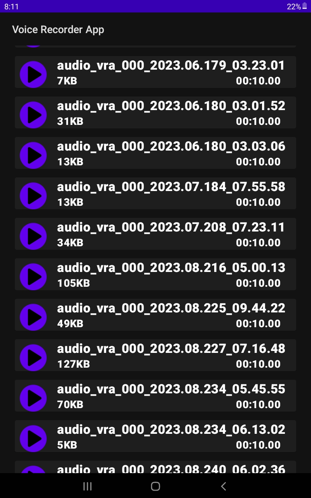

# Android Voice Recorder App

## Screenshots

## Overview
This is an Android application that allows you to record audio, view saved audio recordings and play saved audio recordings. It is built using the Kotlin programming language and developed in Android Studio. It also makes use of dependencies such as Room Database, for local storage, and coroutines, for asynchronous programming. It is tested in an emulator of the Google Pixel 3A.  
The aim of this project is to get better at developing Android applications using the Kotlin programming language, and build an audio recorder for my Android device. I'm also aiming to:
* get better at Object-Oriented Programming,
* understand and implement separation of concerns, such as in the case of using ViewModels,
* better understand and implement asynchronous programming,
* better understand and implement Design Patterns, such as the Observer Pattern, which would make use of LiveData and ViewModels, and
* better understand the Android Application Lifecycle, and by extension Activity Lifecycle.

## Usage
To use this project:
* Download and install [Android Studio](https://developer.android.com/studio) on your local machine.
* Clone this repository to your local machine.
* Click on File at the menu bar at the top of Android Studio, click Open and navigate to the directory where you cloned the project.
* Open the project (dependencies such as Room and coroutines will already be in the build.gradle file so there is no need to make any changes to those unless to upgrade the version being used. Ensure that you click 'Sync Now' if you make any changes in the build.gradle file).

## Functional Requirements/ Deliverables
To consider the app 'complete', or to have some sort of end point to the development of a v1.0, the following are the deliverables for this project:
- [X] The app shall allow the user to record audio.
- [X] The app shall store the user's audio along with metadata such as time duration, file size, file name, length of the audio and its storage location on the device.
- [X] The app shall show the user all audio recordings in a list.
- [X] The app shall allow the user to play any audio recording they choose from the list.
- [ ] The app shall allow the user to view details (metadata) of an audio recording.
- [ ] The app shall allow the user to rename their audio recording whether immediately after recording the audio or when they view the audio recording from the list.
- [X] The app shall allow the user to delete audio recordings from their device.

Completion of v1.1 includes:
- [ ] The app shall prevent the user from leaving the recording screen, once a recording has begun.

## Known Bugs
- If an **audio recording**, **A**, is clicked in the audio list, a Toast will inform the user that audio recording **A** has started playing. However, if *audio recording*, *B*, another audio recording in the list, is clicked, then it stops the playing of audio recording **A** and then generates a Toast which informs the user that audio recording _B_ has stopped, but really it is audio recording **A** that actually stopped.
- Currently, if you start to record audio and go to the **audio list screen (activity)** from _record audio screen (activity)_ then the audio is still being recorded and will stop only when you return to the _record audio screen_ and click the button to stop the recording.
